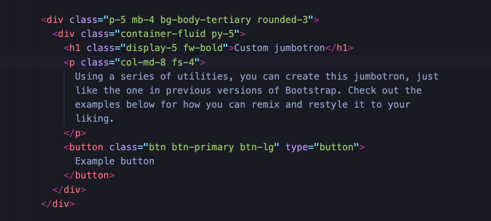

# Get Started With Bootstrap

The goal of this activity is to help you become familiar with Bootstrap 5, a popular framework for rapidly prototyping designs.

It’s easy to start. All you need is the following link, which you’ll place in the `<head>` section of your HTML file:

> `<link href="https://cdn.jsdelivr.net/npm/bootstrap@5.3.0-alpha3/dist/css/bootstrap.min.css" rel="stylesheet" integrity="sha384-KK94CHFLLe+nY2dmCWGMq91rCGa5gtU4mk92HdvYe+M/SXH301p5ILy+dN9+nJOZ" crossorigin="anonymous">`

## Instructions

1. Copy the link above. You can also find the link and other ways to implement [Bootstrap here](https://getbootstrap.com/docs/5.3/getting-started/introduction/).

2. Bookmark this useful link for future projects.

3. Open `starter/index.html`.

4. Paste the Bootstrap link into the `<head>` section of your HTML file.

* That’s it! With the Bootstrap link in place, you’re now free to use Bootstrap and its components on your page.

* **Tip:** You only need to insert the link once for each website you use Bootstrap with.

5. Open [this link](https://getbootstrap.com/docs/5.3/examples/) to the Bootstrap examples page.

6. Click on the `Download examples` button and open the folder titled `bootstrap-5.3.0-alpha3-examples`.

7. Navigate to the `jumbotron` folder. Open the html file and copy the code listed on the page.

> **Note:** There are multiple jumbotron components inside of the html file. Copy the code that matches the image below.

8. Paste the code in the `<body>` of `index.html`. Save your page and refresh to see the changes.

* **Note:** Keep this file open, as you’ll use it during the next few activities.

## Resources

Check out the documentation for details on how to read spacing, text, and border utility classes.

* [Spacing](https://getbootstrap.com/docs/5.3/utilities/spacing/)

* [Text](https://getbootstrap.com/docs/5.3/utilities/text/)

* [Borders](https://getbootstrap.com/docs/5.3/utilities/borders/)

---

© 2023 edX Boot Camps LLC. Confidential and Proprietary. All Rights Reserved.
