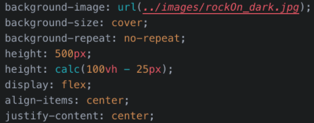
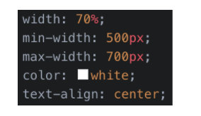

# Custom Webpage Jumbotron

In this activity, you will turn the default Bootstrap 5 jumbotron you have now into a professional-level, attention-grabbing image.  

  

## Instructions

1. Add the `rockBackground` class to the `jumbotron 
`.

* Again, you will be using this class to style this element.

2. Find the `div` with class names `container-fluid py-5`. Add a new class called `jumboCopy`.

3. Update the `
` and change the class `col-md-8` to `col-md-12`.

4. Update the copy and button text in the jumbotron to reflect the design above.

* **Note:** Feel free to add a more compelling description.

5. Add the following CSS within a selector that targets the `jumbotron 
`:

  

6. Add a selector for the `jumboCopy` class with the following properties and values:

  

Great work!

---

© 2023 edX Boot Camps LLC. Confidential and Proprietary. All Rights Reserved.
